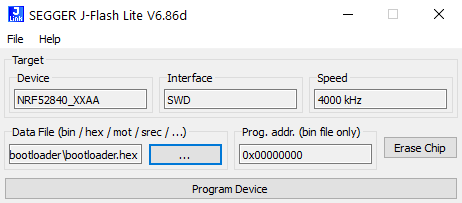

# SensoGrip

Repository consists of software and brief descpription of each individual step to successfuly set up Sensogrip pencil.

**Table of Contents**

- [SensoGrip](#sensogrip)
  * [About The Project](#about-the-project)
    + [Built With](#built-with)
  * [Getting Started](#getting-started)
    + [Prerequisites](#prerequisites)
  * [Installation](#installation)
    + [Uploading bootloader](#uploading-bootloader)
    + [Uploading software via PlatformIO](#Uploading-software-via-PlatformIO)
    + [Uploading software via Arduino IDE](#Uploading-software-via-Arduino-IDE)
  * [Usage](#usage)
  * [License](#license)
  * [Contact](#contact)
  * [Acknowledgements](#acknowledgements)

<!-- ABOUT THE PROJECT -->
## About The Project

Sensogrip pencil was developed as a therapeutical help tool for children with graphomotoric difficulties. It consists of two sensors: one for measuring tip pressure, and the second one for measuring finger pressure. User is able to get feedback via built-in RGB led or via mobile app.

It features:
* Piezoelectric sensor for measuring tip pressure
* FSR sensor for measuring finger pressure
* Optical RGB led feedback (for example: green color lights up when the pressure on the sensors is right)
* Automatic measured pressure correction with angle from build-in IMU
* Sleep funtion with wake-up by shaking
* Bluetooth BLE connectivity
* Rechargable battery, which provides up to 10 hour of operating time
* Mobile App companion

### Built With

* [Arduino](https://www.arduino.cc)
* [PlatformIO](https://platformio.org)
* [Visual Studio Code](https://code.visualstudio.com)
* [Segger](https://www.segger.com/)

<!-- GETTING STARTED -->
## Getting Started

Follow this steps to upload firmware and software to your Sensogrip pencil.

### Prerequisites

* PlatformIO
* [J-Link debugger](https://www.segger.com/products/debug-probes/j-link/)
* [JFlashSPI Software](https://www.segger.com/downloads/jlink)
* Optional: Arduino IDE (with Mbed OS boards support installed)

## Installation

### Uploading bootloader

1. Install [JFlashSPI Software](https://www.segger.com/downloads/jlink)
2. [Connect Segger debugger to Sensogrip board via SWD pins](http://djynet.net/?p=969)
3. Start `JFlashLite.exe` and upload `bootloader.hex` located in the > _utils/bootloader_ folder

### Uploading software via PlatformIO

1. Install [PlatformIO](https://platformio.org)
2. Upload the program

### Uploading software via Arduino IDE

1. Install [Arduino IDE](https://www.arduino.cc/en/guide/windows)
2. Open Arduino IDE, go to File > Preferences and enter
> _https://raw.githubusercontent.com/primozflander/custom_boards/master/package_sensogrip_index.json_
into the “Additional Board Manager URLs”.
3. Go to Tools > Board > Boards Manager. Search for `Sensogrip` and install the boards.
4. Select board `SensoGrip NINA B306` and upload the program.

<!-- USAGE EXAMPLES -->
## Documentation

_For documentation, please refer to the [Documentation](/documentation)_

<!-- LICENSE -->
## License

Distributed under the FH Campus Wien License. See `LICENSE` for more information.

<!-- CONTACT -->
## Contact

Primoz Flander: primoz.flander@fh-campuswien.ac.at

Project Link: [SensoGrip](https://github.com/primozflander/senso-grip)

<!-- ACKNOWLEDGEMENTS -->
## Acknowledgements
* [Gernot Korak](https://www.fh-campuswien.ac.at/forschung/forschende-von-a-z/personendetails/gernot-korak.html)
* [Sebastian Geyer](https://www.fh-campuswien.ac.at/forschung/forschende-von-a-z/personendetails/sebastian-geyer.html)
