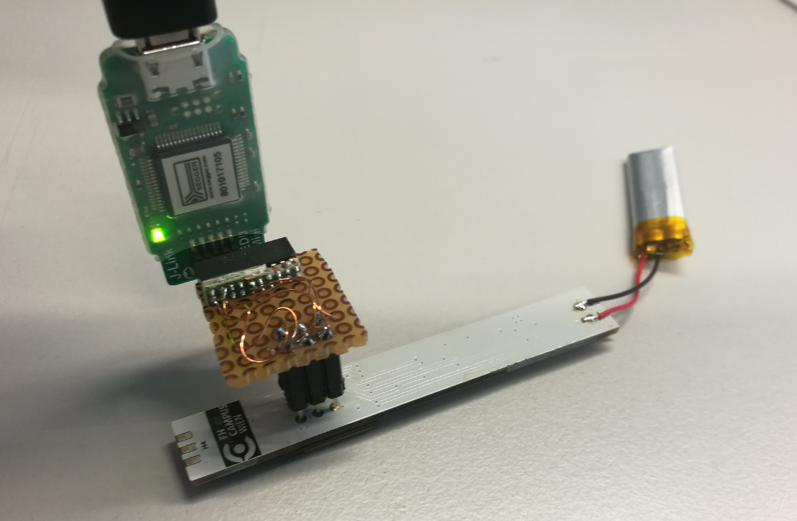
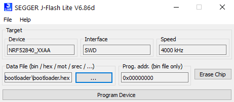
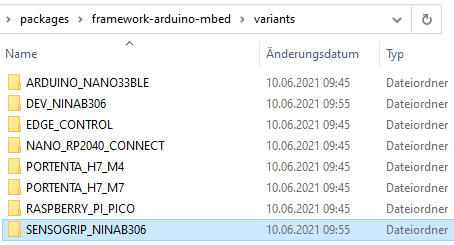

# SensoGrip

Repository consists of software and brief description of each individual step to successfuly set up Sensogrip pencil.

**Table of Contents**

- [SensoGrip](#sensogrip)
  * [About The Project](#about-the-project)
    + [Built With](#built-with)
  * [Getting Started](#getting-started)
    + [Prerequisites](#prerequisites)
    + [Software versions at the time of build](#software-versions-at-the-time-of-build)
  * [Installation](#installation)
    + [Uploading bootloader](#uploading-bootloader)
    + [Uploading software via PlatformIO](#Uploading-software-via-PlatformIO)
  * [License](#license)
  * [Contact](#contact)
  * [Acknowledgements](#acknowledgements)

## About The Project

Sensogrip pencil was developed as a therapeutical help tool for children with graphomotoric difficulties. It consists of two sensors: one for measuring tip pressure, and the second one for measuring finger pressure. User is able to get feedback via built-in RGB led or via mobile app.

It features:
* Piezoelectric sensor for measuring tip pressure
* FSR sensor for measuring finger pressure
* Optical RGB led feedback (for example: green color lights up when the pressure on the sensors is right)
* Automatic measured pressure correction with angle from build-in IMU
* Sleep funtion with wake-up by shaking
* Bluetooth BLE connectivity
* Rechargable battery, which provides up to 10 hour of operating time
* Mobile App companion

### Built With

* [Arduino](https://www.arduino.cc)
* [PlatformIO](https://platformio.org)
* [Visual Studio Code](https://code.visualstudio.com)
* [Segger](https://www.segger.com/)

## Getting Started

Follow this steps to upload firmware and software to your Sensogrip pencil.

### Prerequisites

* PlatformIO
* [J-Link debugger](https://www.segger.com/products/debug-probes/j-link/)
* [JFlashSPI Software](https://www.segger.com/downloads/jlink)

### Software versions at the time of build

* PlatformIO IDE (2.3.3)
* Visual Studio Code (1.59.0)
* [JFlashSPI Software (6.86d)](https://www.segger.com/downloads/jlink)

## Installation

### Uploading bootloader

1. Install [JFlashSPI Software](https://www.segger.com/downloads/jlink)
2. [Connect Segger debugger to Sensogrip board via SWD pins with help of adapter](http://djynet.net/?p=969)

3. Start `JFlashLite.exe` and upload `bootloader.hex` located in the _utils/bootloader_ folder. Make sure that the board is connected to the power supply when uploading the bootloader.

### Uploading software via PlatformIO

1. Install [PlatformIO](https://platformio.org)
2. Replace `boards.txt` file on the path: _C:\Users\your_username\.platformio\packages\framework-arduino-mbed_ with file `boards.txt` from project's `boards` folder
3. Copy SENSOGRIP_NINA306 folder from project's `boards/variants` folder and paste it to the folder on the path: _C:\Users\your_username\.platformio\packages\framework-arduino-mbed\variants_

4. Upload the program

## License

Distributed under the FH Campus Wien License.

## Contact

Primoz Flander: [primoz.flander@fh-campuswien.ac.at](<mailto:primoz.flander@fh-campuswien.ac.at>)

Project Link: [SensoGrip](https://github.com/primozflander/sensogrip_pio), [SensoGrip App](https://github.com/primozflander/sensogrip_app_flutter)

## Acknowledgements
* [Gernot Korak](https://www.fh-campuswien.ac.at/forschung/forschende-von-a-z/personendetails/gernot-korak.html)
* [Sebastian Geyer](https://www.fh-campuswien.ac.at/forschung/forschende-von-a-z/personendetails/sebastian-geyer.html)
